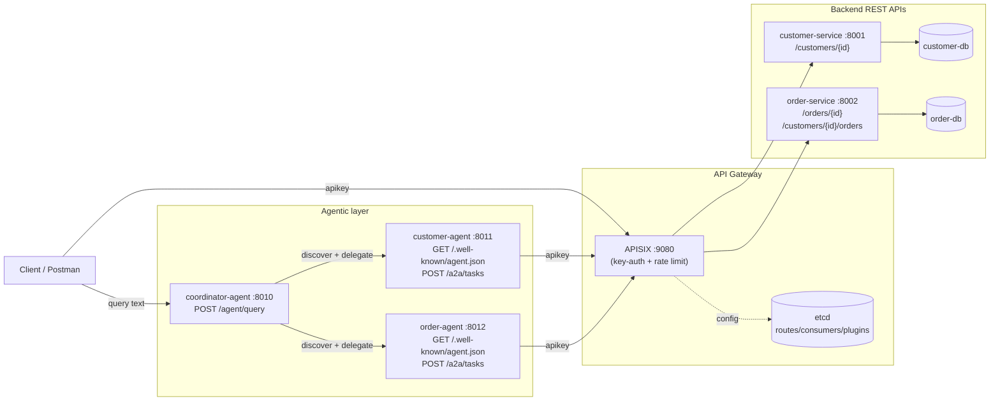

# Partilon API Agents — Technical Assessment

A prototype system that pairs a small e-commerce-style REST API (customers,
orders) with an API Gateway (Apache APISIX) and an agentic layer on top:
three FastAPI "agents" that discover each other, delegate work over a
custom HTTP/JSON Agent-to-Agent (A2A) protocol, and expose a single
natural-language-ish `/agent/query` endpoint that orchestrates both
backend APIs.

This README is a map of what is actually implemented, what is assumed,
and what is explicitly out of scope. Details that need more room live in
[docs/](docs/).

## Status

- Automated test suite: **28/28 passing** (21 earlier + 7 added for the
  gateway-generated correlation ID, order-route rate limiting and
  ID-format validation; integration tests run
  against the full Docker Compose stack — no mocks).
- The original 18-test suite was **stabilized without changing any
  production code** (see `git log`, commit `test: stabilize integration
  and gateway test suite`) — only `tests/conftest.py` and the test files
  were touched to make the suite deterministic (readiness waits, a
  shared rate-limit budget, and APISIX worker resets between
  failure-injection tests).
- APISIX's routes/upstreams/consumer/rate-limit config is now
  **provisioned automatically** by `docker compose up` (see
  [API Gateway](#api-gateway)) — a clean clone with no prior Docker
  volumes reaches a working gateway with no manual step.
- This is a prototype built for assessment purposes, not a
  production-hardened system. See [Production considerations](#production-considerations)
  and [Known limitations](#known-limitations).

## Quick start (install and run)

**Prerequisites:** Docker with the Compose plugin (`docker compose version`), `curl`, free host ports 9080, 8010 and 127.0.0.1:8001/8002/8011/8012/5433/5434/9180. Python 3.10+ is only needed to run the tests locally.

```bash
git clone https://github.com/Dream65010286/API_Agents.git && cd API_Agents

# 1. Build and start everything (databases, etcd, gateway, services, agents).
#    The gateway routes/consumer/plugins are provisioned automatically by the
#    one-shot `apisix-provision` container; no manual step.
docker compose up --build -d

# 2. Check it is up: 10 containers, apisix-provision shows "Exited (0)".
docker compose ps -a

# 3. Try it.
curl -H "apikey: partilon-api-key-2026" http://127.0.0.1:9080/api/customers/C001
curl -X POST http://127.0.0.1:8010/agent/query -H "Content-Type: application/json" \
     -d '{"query":"Find customer C001 and tell me their latest order status"}'

# 4. Run the automated tests (28) against the live stack.
pip install -r tests/requirements.txt && pytest -v

# 5. Or rebuild from scratch and save raw evidence (commands + output):
./scripts/collect_evidence.sh        # writes docs/evidence/evidence-<time>.txt

# Stop (add -v to also delete the databases and gateway config volume):
docker compose down
```

| Setting | Value | Where |
|---|---|---|
| Public API (gateway) | `http://127.0.0.1:9080` | `docker-compose.yml` |
| Agent API (coordinator) | `http://127.0.0.1:8010/agent/query` | `docker-compose.yml` |
| API key (consumer `partilon-client`) | `partilon-api-key-2026`, send as header `apikey` | `docker-compose.yml`, `provision.sh` |
| Rate limit | customer route 5 req / 10 s, per consumer; order routes are not rate limited | `gateway/apisix/provision/provision.sh` |
| Correlation ID | header `X-Correlation-ID`, generated by the gateway when absent | `provision.sh` (`request-id`) |
| Metrics | Prometheus, internal port 9091 of the `apisix` container | `provision.sh` (global rule) |
| OpenAPI specs | `docs/openapi/*.openapi.json` (also live at `:8001/docs`, `:8002/docs`) | exported from FastAPI |
| Architecture diagrams | `docs/architecture-diagram.md` (Mermaid) | |

All keys and passwords here are demo values; see [Known limitations](#known-limitations).

## Overview

The system has three layers:

1. **Backend REST APIs** — `customer-service` and `order-service`, each a
   thin FastAPI app backed by its own PostgreSQL database.
2. **API Gateway** — Apache APISIX in front of both services, handling
   API-key authentication and rate limiting for the customer API.
3. **Agentic layer** — three FastAPI "agents" (`customer-agent`,
   `order-agent`, `coordinator-agent`) that talk to each other over a
   custom A2A HTTP/JSON protocol and to the backend APIs through the
   gateway. A client talks to the `coordinator-agent`'s `/agent/query`
   endpoint and gets back customer/order data assembled from both
   backends.

See [docs/architecture.md](docs/architecture.md) for diagrams.

## Assessment requirements covered

The functional areas below are covered by the implementation; see
[docs/requirements-mapping.md](docs/requirements-mapping.md) for the
detailed mapping to code, tests, and the assumptions made where the
original brief is not in this repository.

| Area | Status |
|---|---|
| REST API design (customers, orders) | Implemented |
| API Gateway (routing, auth, rate limiting) | Implemented |
| API-key authentication | Implemented at the gateway only |
| Rate limiting | Implemented on the customer API route only |
| Correlation ID / observability | Implemented, with gaps (see below) |
| Agentic API (`/agent/query`) | Implemented, deterministic (not LLM-based) |
| Agent discovery (agent cards) | Implemented for the two worker agents |
| A2A communication | Implemented as a custom, simplified protocol |
| Failure handling | Implemented; dependency-down and error propagation tested |
| Automated tests | 28/28, against the real Docker Compose stack |

## Architecture



Full component, sequence, and failure-path diagrams are in
[docs/architecture.md](docs/architecture.md).

## Technology choices and rationale

| Choice | Why |
|---|---|
| **FastAPI** for every service/agent | Small amount of boilerplate for REST + JSON, async-native (works well with `httpx` fan-out calls in the agents), automatic OpenAPI docs at `/docs` on each service. |
| **PostgreSQL per service** (`customer-db`, `order-db`) | Database-per-service: `customer-service` and `order-service` each own their schema, no shared database, no cross-service SQL joins — order/customer joins happen at the application layer (in `order-agent`/`coordinator-agent`), matching a microservice boundary. |
| **psycopg (v3)** | Modern, maintained Postgres driver for Python; used with a plain synchronous connection per request (no pooling) — adequate for this prototype's load. |
| **httpx (async)** | Used by the agents to call each other and the gateway concurrently/async, with explicit per-call timeouts (5s). |
| **Apache APISIX + etcd** | A real, production-grade API gateway rather than hand-rolled auth/rate-limit middleware, to demonstrate gateway-level (not application-level) authentication and rate limiting. etcd is APISIX's supported config store for the `traditional` deployment mode used here. |
| **Docker Compose** | Single-command local orchestration of 10 containers (2 databases, 2 services, etcd, APISIX, apisix-provision, 3 agents); no Kubernetes/Helm — intentionally out of scope for this assessment. |
| **pytest + httpx, no mocks** | The test suite (`tests/`) runs against the real Compose stack (real Postgres, real APISIX, real HTTP calls between agents) rather than mocking collaborators, so a pass is evidence the integrated system behaves correctly, not just each unit in isolation. |

## Repository structure

```
services/
  customer-service/   FastAPI REST API for customers (owns customer-db)
  order-service/      FastAPI REST API for orders (owns order-db)
agents/
  customer-agent/      A2A agent wrapping the customer API
  order-agent/         A2A agent wrapping the order API
  coordinator/          Agentic entry point: discovery + A2A delegation
database/
  customer/init.sql    Seed schema + sample rows for customer-db
  order/init.sql       Seed schema + sample rows for order-db
gateway/
  apisix/config/config.yaml   APISIX node config (etcd-backed, traditional mode)
tests/                 Integration test suite (pytest), run against Compose
docs/                  This documentation set
postman/               Postman collection for manual exploration
docker-compose.yml     The entire stack
```

APISIX routes, upstreams, the consumer and plugins are declared in
`gateway/apisix/provision/provision.sh` (applied automatically by the
`apisix-provision` service) — see [API Gateway](#api-gateway). Raw test
evidence lives in `docs/evidence/`, OpenAPI specs in `docs/openapi/`.

## API design

Two plain REST APIs, each with its own Postgres database:

**customer-service** (direct: `http://localhost:8001`)
- `GET /health`
- `GET /customers/{customer_id}` → `404 CUSTOMER_NOT_FOUND` if missing

**order-service** (direct: `http://localhost:8002`)
- `GET /health`
- `GET /orders/{order_id}` → `404 ORDER_NOT_FOUND` if missing
- `GET /customers/{customer_id}/orders` → `200 []` if the customer has no orders (not a 404)

Both services return structured errors as `{"detail": {"error": "<CODE>", "message": "<text>"}}`
(FastAPI's standard `HTTPException(detail=...)` shape). Seed data (from
`database/*/init.sql`): customers `C001` (Alice Johnson), `C002` (Bob
Smith); orders `O1001`/`O1002` for `C001`, `O1003` for `C002`.

Full request/response reference: [docs/api.md](docs/api.md).

**Note:** these ports (8001, 8002) are published by `docker-compose.yml`
on `127.0.0.1` only (not on the network) for local testing/debugging.
Neither service has its own authentication — hitting them directly from the
host bypasses the gateway's API-key check and rate limiting. See
[Known limitations](#known-limitations).

## API Gateway

Apache APISIX (`apache/apisix:3.17.0-debian`) sits in front of both
backend services at `http://localhost:9080`, backed by its own `etcd`
instance for configuration (`gateway/apisix/config/config.yaml`, role
`traditional` / `config_provider: etcd`).

Behavior observed and verified by the test suite (`tests/test_gateway.py`,
`tests/conftest.py`):

- `GET /api/customers/{id}` → proxied to `customer-service`, **requires**
  an `apikey` header, and is **rate limited**.
- `GET /api/orders/{id}` and `GET /api/customers/{id}/orders` → proxied
  to `order-service`, also require the `apikey` header, but are **not**
  rate limited.

**Provisioning is automatic and declarative.** `gateway/apisix/config/config.yaml`
only configures the APISIX node itself (ports, etcd connection, admin
key) — it never declared any routes. The routes, upstreams, API-key
consumer, and rate-limit plugin are defined in
[gateway/apisix/provision/provision.sh](gateway/apisix/provision/provision.sh)
and applied by a one-shot `apisix-provision` Compose service that runs
every `docker compose up` (idempotent — it `PUT`s to fixed Admin API
resource IDs, so re-running it just re-applies the same config, never
duplicates it). It shares the `apisix` container's network namespace
(`network_mode: "service:apisix"`), so it reaches the Admin API over
`127.0.0.1:9180` — always permitted by `config.yaml`'s existing
`allow_admin: 127.0.0.0/24` rule, regardless of what subnet Docker
assigns the compose network. **No change to `config.yaml` or to any
existing service was needed.**

One routing detail worth knowing: APISIX's **default** router
(`radixtree_host_uri`) does not support the `:name` path-parameter
syntax (e.g. `/api/customers/:customer_id`) — that requires a different,
non-default router. Rather than change the gateway's router mode, the
provisioning routes use a wildcard prefix (`/api/customers/*`) plus the
`proxy-rewrite` plugin's `regex_uri` field to strip the `/api` prefix,
with `priority`/`vars` disambiguating `/api/customers/{id}/orders` (→
`order-service`) from `/api/customers/{id}` (→ `customer-service`, rate
limited). This was verified empirically against a running stack, not
assumed — see [docs/architecture.md](docs/architecture.md).

See [Known limitations](#known-limitations) for what's still not
reproducible (etcd remains the gateway's live config store — this
automates re-creating it, it doesn't eliminate etcd as a moving part).

## Authentication

- Enforced only at the gateway, via APISIX's `key-auth` plugin on both
  routes. Requests without an `apikey` header get `401` with APISIX's own
  error body (`{"message": "Missing API key in request"}`, verified by
  `test_customer_api_requires_api_key`).
- The shared key used throughout (docker-compose env vars, tests) is
  `partilon-api-key-2026` — a single consumer/key for every caller
  (agents and test suite alike); there is no per-agent or per-client
  identity.
- The backend services (`customer-service`, `order-service`) and the
  agents (`customer-agent`, `order-agent`, `coordinator-agent`) implement
  **no authentication of their own** — auth is a gateway-only concern.
  Any caller that can reach a service's or agent's container port
  directly is fully trusted.

## Rate limiting

- Implemented via APISIX's `limit-count` plugin on the customer route
  only: **5 requests / 10-second window**, keyed per consumer (so it is a
  single, shared budget across every caller using the one API key —
  direct curl/Postman calls, `customer-agent`, and the coordinator all
  draw from the same bucket).
- Exceeding the limit returns `429`.
- The order routes (`/api/orders/{id}`, `/api/customers/{id}/orders`) are
  **not** rate limited.
- Verified by `test_customer_api_rate_limit` (5 requests succeed, a 6th
  within the window returns 429) and exercised indirectly by the agent
  tests via the shared `customer_api_budget` fixture in `tests/conftest.py`.

## Correlation ID / observability

- The gateway's `request-id` plugin (on every route) generates an
  `X-Correlation-ID` when the caller sends none, keeps the caller's value
  when present, and returns it in the response.
- Agents forward the ID on every outbound call (A2A tasks and calls back
  through the gateway). If an agent is called directly without one, it
  generates a UUID.
- `customer-service` and `order-service` run it as middleware on every
  request, log it, echo it as a response header, and generate a UUID if it
  is absent. The three agents log it at each step and include
  `correlation_id` in the JSON body (not as a response header).
- The APISIX access log records `correlation_id=<id>` on every line, so the
  gateway hop is matched with the service and agent logs.
- Prometheus metrics are enabled as an APISIX global rule (internal port
  9091 of the `apisix` container): request counts by route, consumer and
  status code.
- Tracing is logs-based (`docker compose logs`); there is no tracing
  backend. See scenario 10 in [docs/demo.md](docs/demo.md) and the
  captured run in `docs/evidence/` (one ID found in 6 components).

## Agentic API

`POST /agent/query` on `coordinator-agent` (`http://localhost:8010`)
takes `{"query": "<free text>"}` and:

1. Extracts a customer ID with the regex `\bC\d{3}\b` (e.g. "C001") and
   an order ID with `\bO\d{4}\b` (e.g. "O1001"), both case-insensitive.
   Neither found → `400 CUSTOMER_ID_NOT_FOUND`.
2. **If no customer ID was found but an order ID was** (e.g. "What is
   the status of order O1001?"), the coordinator discovers `order-agent`
   and delegates a single `get_order` task directly — no customer lookup
   at all. This is the `Coordinator → Order Agent → A2A delegation →
   Order Service → Order DB` path.
3. **Otherwise** (a customer ID was found), the existing behavior
   applies: capabilities needed are decided purely by substring match on
   the words `"customer"` and `"order"` in the query (lower-cased); if
   neither word is present → `400 UNSUPPORTED_REQUEST`. For each
   capability needed, the coordinator discovers the relevant agent
   (`GET /.well-known/agent.json`) and delegates a task to it over A2A
   (`POST /a2a/tasks`), then assembles the results.

This is a **deterministic, rule-based planner** — there is no LLM, no
free-form reasoning, and no tool selection beyond the keyword/ID checks
above. "Agentic" here refers to the discovery + delegation architecture
(agent cards, A2A task delegation, dynamic per-request orchestration
across two independent agents), not to any model-driven planning. A
query containing *both* a customer ID and an order ID is not specially
handled — the customer-centric flow wins and the order ID in the text is
ignored, which is a known limitation (see below), not a combined-ID
scenario the PDF's examples actually require.

Full request/response reference and error table: [docs/api.md](docs/api.md).

## Agent discovery

- `customer-agent` and `order-agent` each expose
  `GET /.well-known/agent.json` — a static "agent card" describing their
  name, a text description, and a list of named capabilities
  (`get_customer`; `get_order` and `get_latest_order` respectively).
- `coordinator-agent` calls this endpoint before delegating a task, on
  every request (no caching) — effectively used as a liveness/capability
  probe rather than for genuine capability negotiation, since the set of
  capabilities it will request is already fixed by the keyword rules in
  `/agent/query`.
- `coordinator-agent` itself has **no agent card** — it is the
  orchestrating client, not a discoverable worker. Discovery is
  one-directional (coordinator discovers workers; nothing discovers the
  coordinator).
- `order-agent` advertises a `get_order` capability (lookup by order ID)
  that is implemented, reachable via `POST /a2a/tasks`, **and invoked by
  the coordinator** for order-ID-only queries (see
  [Agentic API](#agentic-api) above) — covered by
  `test_coordinator_order_by_id` in `tests/test_agents.py`. See
  [docs/a2a.md](docs/a2a.md) for the full delegation flow.

## A2A communication

A custom, simplified HTTP/JSON task-delegation protocol
(`"protocol": "http-json-a2a"` in each agent card) — **not** the formal
Google/Linux-Foundation Agent2Agent (A2A) specification. Full details,
including exactly how it differs from the real A2A spec, are in
[docs/a2a.md](docs/a2a.md). In short:

- `POST /a2a/tasks` with `{"task_id", "action", "customer_id"?, "order_id"?}`.
- Synchronous only — the HTTP response *is* the completed result; there
  is no task-status polling, streaming, or push-notification mechanism.
- No authentication between agents (coordinator → worker agent calls
  carry no API key or token — only the worker → gateway calls do).

## Failure handling

Tested failure paths (`tests/test_agents.py`, using the `stopped_service`
fixture which stops/starts a real Docker Compose container):

| Scenario | Coordinator response |
|---|---|
| `customer-agent` container stopped | `502 CUSTOMER_AGENT_UNAVAILABLE` (discovery call fails) |
| `order-agent` container stopped | `502 ORDER_AGENT_UNAVAILABLE` (discovery call fails) |
| `customer-service` backend stopped (agent itself is up, reachable through APISIX) | `502 CUSTOMER_AGENT_ERROR` (agent reachable, but its downstream call failed) |
| Downstream rate-limited (`429` from APISIX) | Propagated up as `429 CUSTOMER_API_RATE_LIMITED` / `ORDER_API_RATE_LIMITED` |
| Downstream timeout (5s client timeout, `httpx.TimeoutException`) | `504 ..._TIMEOUT` |
| Unknown customer/order | `404` with a specific error code at each layer |

Every HTTP call made by an agent (`httpx.AsyncClient(timeout=5.0)`) is
wrapped so that timeouts and connection errors become `504`/`502`
responses with a structured `{"error", "message"}` body rather than an
unhandled exception — see [docs/api.md](docs/api.md) for the full error
code table.

## Deployment

`docker compose up --build -d` starts the entire stack: two Postgres
databases (seeded from `database/*/init.sql`), `etcd`, `apisix`, the
one-shot `apisix-provision` job, `customer-service`, `order-service` and the
three agents (10 containers; `apisix-provision` exits 0 when done).

- `apisix-provision` runs `gateway/apisix/provision/provision.sh`, which
  PUTs fixed-ID upstreams, the API-key consumer, and the three routes
  with key-auth, request-id and proxy-rewrite; limit-count is applied
  only to the customer route.
- Host ports for services, agents and databases are bound to `127.0.0.1`;
  only the gateway (9080) and the coordinator (8010) accept outside traffic.
- No Kubernetes/Helm chart and no CI/CD pipeline in this repository.

## Testing

```
pip install -r tests/requirements.txt
docker compose up --build -d
pytest -v
```

- 28 integration tests run against the live Compose stack (no mocks):
  agents 10, customer service 5, gateway 6, order service 7.
- `tests/conftest.py` waits for every container and APISIX worker, reloads
  APISIX between failure-injection tests (per-worker DNS caches, see
  [docs/architecture.md](docs/architecture.md)) and tracks a shared budget
  against the customer route's rate limit.
- `./scripts/collect_evidence.sh` rebuilds from scratch, runs each demo
  scenario and the test suite, and stores the raw commands and output in
  `docs/evidence/`.

## Demo scenarios

Ten scripted scenarios (customer lookup, agent delegation, multi-agent
coordination, rate limiting, each failure mode, and an end-to-end
correlation trace) are fully written out with exact commands and
expected output in [docs/demo.md](docs/demo.md).

## Assumptions

- A single APISIX consumer/API key is sufficient (no per-client identity
  or scoped permissions needed for this assessment).
- "Agentic" was interpreted as agent discovery + A2A task delegation with
  a deterministic planner, not an LLM-backed agent — no LLM API key or
  model dependency is required to run or demo this system.
- A caller may supply its own correlation ID; if it does not, the gateway
  generates one.
- Local/single-host Docker Compose is the target deployment for this
  assessment, not a multi-node or cloud environment.
- The two worker agents' direct HTTP ports (8011, 8012) and the backend
  service ports (8001, 8002) are reachable from the host machine itself
  (bound to 127.0.0.1) for testing/demo purposes; they are not exposed to
  the network.

## Known limitations

- **APISIX's live config still lives in the `etcd-data` Docker volume,
  not in `config.yaml`.** This is no longer a reproducibility problem —
  `docker compose up` now re-provisions routes/upstreams/consumer
  automatically every time via `gateway/apisix/provision/provision.sh`
  (see [API Gateway](#api-gateway)) — but etcd is still where APISIX
  reads routes from at runtime, so deleting `etcd-data` mid-session and
  *not* re-running `docker compose up` (e.g. `docker compose down -v`
  followed only by `docker compose up apisix` with `--no-deps`, skipping
  the `apisix-provision` service) would still leave an empty gateway
  until the next full `docker compose up`.
- **No authentication on backend services or agents.** `customer-service`,
  `order-service`, `customer-agent`, and `order-agent` all trust any
  caller that reaches their container port directly; only the two
  gateway-fronted routes enforce an API key.
- **No authentication between agents.** `coordinator-agent` calling
  `customer-agent`/`order-agent` over A2A, and discovery calls, carry no
  credential at all.
- **The coordinator endpoint (`POST /agent/query`, :8010) is not behind the
  gateway** and has no authentication of its own; in production it would be
  routed through the gateway.
- **Gateway rate limits are per consumer and shared by all callers** (5
  requests / 10 s on the customer route, 50 / 10 s on the order routes).
- **Downstream timeout (504) paths exist in code but have no automated
  test.**
- **Single, shared API key.** Every caller (agents, tests, a human
  operator) uses the same `apikey` value and is rate-limited as one
  consumer.
- **A missing APISIX route is indistinguishable from "record not
  found."** APISIX's own "no matching route" response is a plain `404`,
  and the agents treat any `404` from the gateway as "customer/order
  doesn't exist." This is much less likely to surface in practice now
  that provisioning is automatic, but the underlying ambiguity in the
  agents' error handling is unchanged — see
  [docs/architecture.md](docs/architecture.md#a-real-world-consequence-a-missing-route-looks-like-a-404-from-the-data-not-the-gateway).
- **The `coordinator-agent`'s planner is keyword/regex-based**, not
  semantic — e.g. a query that doesn't literally contain the word
  "order" (and has no `O####` token) will never trigger an order lookup,
  even if its intent clearly requires one. A query containing *both* a
  customer ID and an order ID ignores the order ID (see
  [Agentic API](#agentic-api)).
- Secrets (the API key, the APISIX admin key, database passwords) are
  plain environment variables / plaintext config in `docker-compose.yml`
  and `gateway/apisix/config/config.yaml` — fine for a local assessment,
  not for production.

## Incomplete functionality

- No `PUT`/`POST`/`DELETE` endpoints anywhere — the system is read-only
  (GET-only) on both backend APIs and both A2A actions that are actually
  exercised.
- No pagination on `GET /customers/{id}/orders` (fine at seed-data scale;
  would need addressing for real data volumes).
- No persistence of A2A task state — every task is a one-shot synchronous
  call; there is no way to query a past task's status or result after
  the fact.
- A query containing both a customer ID and an order ID is not specially
  handled — only the customer-centric flow runs; the order ID is parsed
  but ignored in that case.

## Architecture decisions

- **Gateway-level auth/rate-limiting, not application-level** — chosen to
  demonstrate a real API Gateway's responsibilities rather than
  reimplement them in FastAPI middleware.
- **Database-per-service** — `customer-service` and `order-service` never
  share a database or query each other's tables directly; the
  "customer + their latest order" join happens in the application layer
  (`order-agent`/`coordinator-agent`), which is why `get_latest_order`
  is an order-agent capability rather than a cross-service SQL query.
- **A2A kept deliberately simple** — a single synchronous
  `POST /a2a/tasks` endpoint per agent, rather than implementing the
  full A2A spec (JSON-RPC, SSE streaming, task lifecycle/polling), since
  the assessment's orchestration needs are a fixed, two-step delegation.
- **Deterministic planner over an LLM** — keeps the demo reproducible and
  dependency-free (no external model API, no non-determinism in tests).
- **Integration tests over unit tests with mocks** — the suite spins up
  the real Compose stack and asserts on real HTTP responses, including
  real container stop/start for failure injection, so a pass is evidence
  about the *integrated* system, including APISIX and Postgres, not just
  isolated application code.
- **Idempotent Admin API provisioning over APISIX's declarative/standalone
  mode** — `gateway/apisix/provision/provision.sh` `PUT`s fixed-ID
  resources to the Admin API rather than switching APISIX's
  `config_provider` away from `etcd`, so the existing `traditional`
  mode (and the worker-reload/DNS-caching behavior already documented in
  [docs/architecture.md](docs/architecture.md)) didn't need to change.
- **Wildcard + `regex_uri` routes over APISIX's parameterized router** —
  the default `radixtree_host_uri` router doesn't support `:name`
  path-parameter capture (that's a separate, non-default router). Rather
  than change the gateway's router mode for one feature, routes use a
  wildcard prefix and the `proxy-rewrite` plugin's `regex_uri` field,
  which works with the default router. Verified empirically against a
  running stack (not assumed) — see
  [docs/architecture.md](docs/architecture.md).
- **The provisioning container shares APISIX's network namespace**
  (`network_mode: "service:apisix"`) so it always reaches the Admin API
  over `127.0.0.1`, which `config.yaml`'s existing `allow_admin` rule
  already permits — avoiding a dependency on whatever subnet Docker
  happens to assign the compose network, without loosening that
  existing security rule.

## Production considerations

Written for a reader with production experience; not implemented, only
discussed in [docs/architecture.md](docs/architecture.md) and here:

- Promote the Admin-API provisioning script to a full declarative/IaC
  setup (APISIX's `apisix-standalone` mode, or Terraform against the
  Admin API) if the gateway's desired state needs to be diffed/reviewed
  like other infrastructure, rather than applied by a shell script.
- Per-client API keys/consumers instead of one shared key, plus mutual
  auth (mTLS or signed tokens) between agents and between an agent and
  the gateway.
- Server-side correlation ID generation (UUID) when a caller omits the
  header, applied consistently as both a response header and a log
  field at every hop, plus propagation into a real tracing backend
  (e.g. OpenTelemetry) instead of plain-text log lines.
- Secrets (API keys, DB passwords, the APISIX admin key) moved out of
  `docker-compose.yml`/`config.yaml` into a secrets manager or
  Docker/Compose secrets.
- Connection pooling for Postgres (`psycopg_pool` or PgBouncer) instead
  of one connection per request.
- Health/readiness checks and restart policies for the service and agent
  containers (currently only the two Postgres containers have a
  `healthcheck`).
- If the formal A2A spec's broader guarantees are needed (task
  persistence/polling, streaming, multi-agent negotiation beyond a fixed
  two-step plan), adopt an actual A2A SDK rather than the current
  hand-rolled subset.
