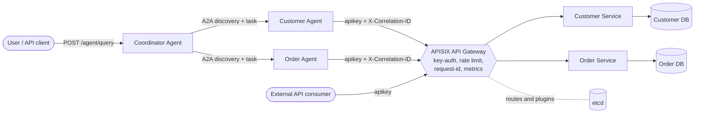
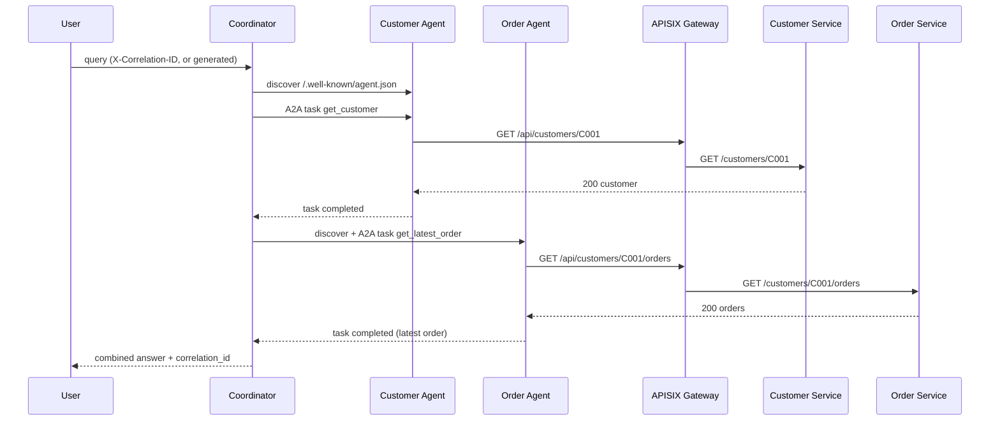

# Architecture diagrams

Rendered automatically by GitHub (Mermaid).

## 1. Components and request path

```mermaid
flowchart LR
    U([User / API client]) -->|POST /agent/query| CO[Coordinator Agent]
    CO -->|A2A discovery + task| CA[Customer Agent]
    CO -->|A2A discovery + task| OA[Order Agent]
    CA -->|apikey + X-Correlation-ID| GW{{APISIX API Gateway<br/>key-auth, rate limit,<br/>request-id, metrics}}
    OA -->|apikey + X-Correlation-ID| GW
    U2([External API consumer]) -->|apikey| GW
    GW --> CS[Customer Service]
    GW --> OS[Order Service]
    CS --> CDB[(Customer DB)]
    OS --> ODB[(Order DB)]
    GW -. routes and plugins .- ET[(etcd)]
```

## 2. "Find customer C001 and tell me their latest order status"

```mermaid
sequenceDiagram
    participant U as User
    participant CO as Coordinator
    participant CA as Customer Agent
    participant OA as Order Agent
    participant GW as APISIX Gateway
    participant CS as Customer Service
    participant OS as Order Service
    U->>CO: query (X-Correlation-ID, or generated)
    CO->>CA: discover /.well-known/agent.json
    CO->>CA: A2A task get_customer
    CA->>GW: GET /api/customers/C001
    GW->>CS: GET /customers/C001
    CS-->>CA: 200 customer
    CA-->>CO: task completed
    CO->>OA: discover + A2A task get_latest_order
    OA->>GW: GET /api/customers/C001/orders
    GW->>OS: GET /customers/C001/orders
    OS-->>OA: 200 orders
    OA-->>CO: task completed (latest order)
    CO-->>U: combined answer + correlation_id
```
