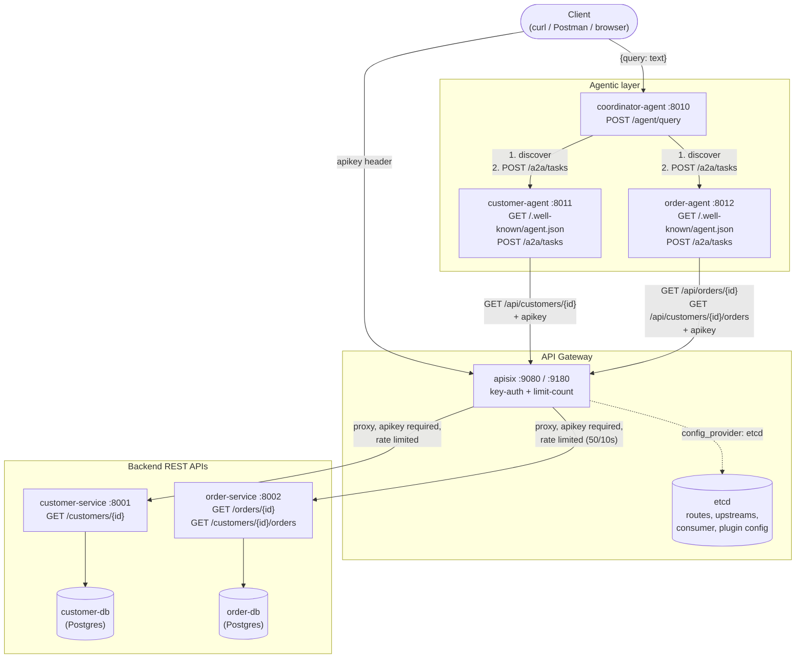
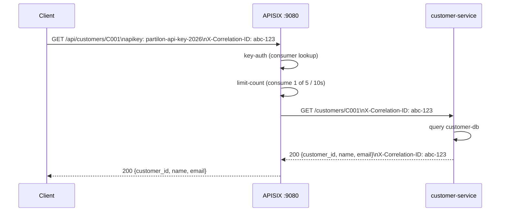
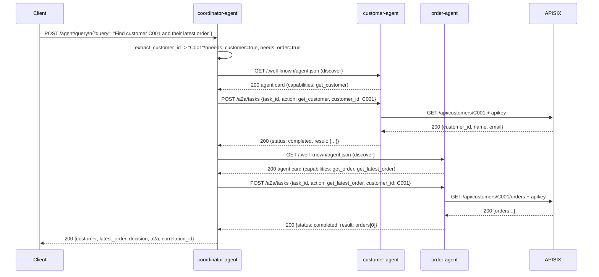
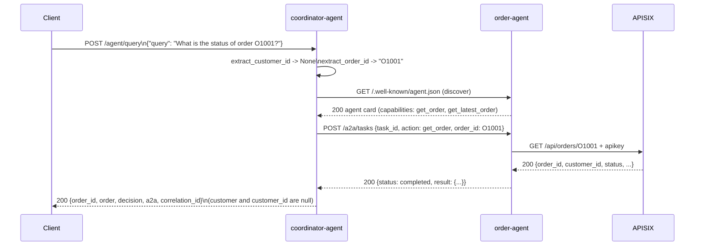
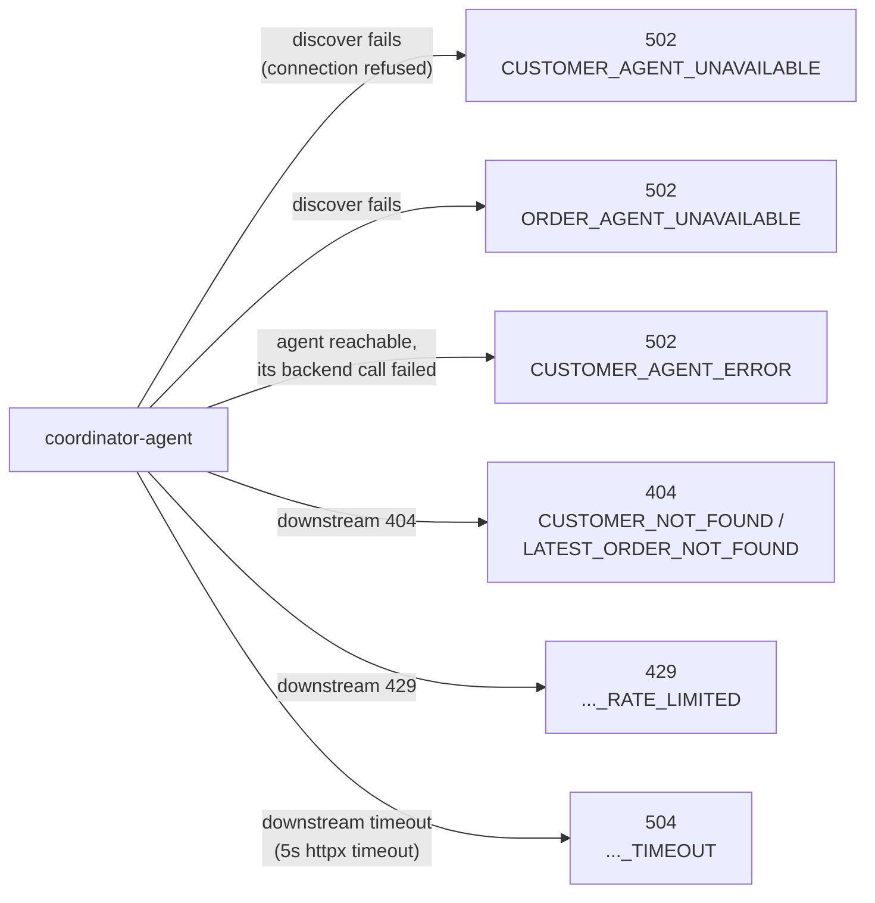

# Architecture

This describes what `docker-compose.yml` actually stands up and how the
pieces talk to each other. All of it is implemented and covered by
`tests/`, unless a section is explicitly marked as an assumption,
limitation, or production consideration.

## Components

| Container | Image / build | Host port(s) | Purpose |
|---|---|---|---|
| `customer-db` | `postgres:16-alpine` | 5433 → 5432 | Owns the `customers` table (`database/customer/init.sql`) |
| `order-db` | `postgres:16-alpine` | 5434 → 5432 | Owns the `orders` table (`database/order/init.sql`) |
| `customer-service` | `services/customer-service` | 8001 → 8000 | REST API for customers |
| `order-service` | `services/order-service` | 8002 → 8000 | REST API for orders |
| `etcd` | `bitnamilegacy/etcd:3.5.11` | — (internal only) | Config store for APISIX |
| `apisix` | `apache/apisix:3.17.0-debian` | 9080 (gateway), `127.0.0.1:9180` (admin) | API Gateway: routing, `key-auth`, `limit-count` |
| `customer-agent` | `agents/customer-agent` | 8011 → 8000 | A2A worker wrapping customer-service |
| `order-agent` | `agents/order-agent` | 8012 → 8000 | A2A worker wrapping order-service |
| `coordinator-agent` | `agents/coordinator` | 8010 → 8000 | Agentic entry point: discovery + A2A orchestration |

Every application container is on one bridge network, `partilon-network`.
Only `customer-db`/`order-db` have a Compose `healthcheck`; the other
containers rely on `depends_on` (container-started, not necessarily
ready) — which is why `tests/conftest.py` polls each service's HTTP
endpoint before running any test (see [Startup ordering](#startup-ordering-and-readiness)).

## Component diagram



## Request flow: direct REST call through the gateway



If the `apikey` header is missing, APISIX rejects the request with `401`
before it ever reaches `customer-service` or counts against the rate
limit (`test_customer_api_requires_api_key`). If the 5-per-10s budget is
already spent, APISIX rejects with `429` the same way
(`test_customer_api_rate_limit`).

## Request flow: agentic multi-agent orchestration



Both agent calls run inside the same `agent_query` handler and share a
single `httpx.AsyncClient`, but are issued sequentially (customer first,
then order) — not concurrently.

## Request flow: order-only lookup by ID (no Customer Agent involved)



`customer-agent` is never discovered or called in this path — verified
directly: `a2a` in the response contains only `order_agent`, and
`decision.selected_tools == ["get_order"]`. This is the
`Coordinator → Order Agent → A2A delegation → Order Service → Order DB`
path, covered by `test_coordinator_order_by_id` in `tests/test_agents.py`.

## Failure-path behavior



This matches the scenarios in `tests/test_agents.py` and is written out
step by step in [docs/demo.md](docs/demo.md) (scenarios 3, 6, 7).

## Startup ordering and readiness

`docker-compose.yml`'s `depends_on` only waits for the two Postgres
containers' `healthcheck` (customer-db, order-db); `apisix` and the
agents have no healthcheck and start as soon as their container process
starts, which is before:

- `apisix` has necessarily loaded its routes from etcd, or
- the services/agents are actually accepting connections.

The test suite does not rely on `depends_on` for this — `tests/conftest.py`
polls each service's own health/discovery endpoint
(`wait_for_http`/`wait_for_service_ready`) before running any test, and
specifically polls `apisix` for **both** a `401` (unauthenticated
customer route, proves routes are loaded) and a `200` (authenticated
order route, proves an upstream is reachable), requiring 10 consecutive
successes to account for APISIX spreading requests across multiple
nginx worker processes (`wait_for_gateway_ready`). This is a test-suite
concern, not something `docker compose up` itself guarantees — a human
running `docker compose up` right before using the system may see
transient errors for a few seconds.

## APISIX worker DNS caching (operational consideration)

Each APISIX nginx worker process keeps its own DNS cache for upstream
hostnames (e.g. `customer-service`). Observed behavior, documented in
`tests/conftest.py`:

- If a worker resolves `customer-service` to an IP, and that container
  is then stopped and restarted (new container, new IP), the worker may
  keep using the **stale IP** and hang/fail against a dead address.
- If a worker tries to resolve `customer-service` **while the container
  is stopped**, it can cache the resulting `NXDOMAIN` and keep returning
  `503 no valid upstream node` for a time **after** the container is
  back up and resolvable again.

Workaround used by the test suite: `apisix reload` (`compose exec apisix
apisix reload`) replaces APISIX's nginx workers with fresh ones, with no
DNS cache, while keeping the same routes, consumers, and rate-limit
counters (both live in etcd / shared memory, not in worker state). The
suite calls this both before the whole run (`healthy_baseline`) and
immediately after restarting `customer-service` in failure-injection
tests, specifically so the recovery check is deterministic.

**This is a real operational characteristic of running APISIX behind
Docker's dynamic container IPs, not a test-only concern** — anyone
restarting `customer-service` or `order-service` in this stack should
expect the same staleness window against the live gateway, and should
reload or restart `apisix` (or wait out APISIX's DNS TTL) to recover
promptly.

## APISIX provisioning: declarative script, applied automatically

APISIX's runtime config store is still `etcd` — `gateway/apisix/config/config.yaml`
configures the APISIX **node** (which port to listen on, `traditional`
mode backed by `etcd`, the admin API port/key, which CIDRs may call the
Admin API) and still declares no routes itself, by design (it's node
bootstrap config, not route config).

What changed: the routes, upstreams, and API-key consumer are now
declared in [gateway/apisix/provision/provision.sh](../gateway/apisix/provision/provision.sh)
and applied by a dedicated one-shot Compose service, `apisix-provision`,
which runs on every `docker compose up`:

```yaml
apisix-provision:
  image: curlimages/curl:8.11.1
  network_mode: "service:apisix"
  volumes:
    - ./gateway/apisix/provision:/provision:ro
  entrypoint: ["sh", "/provision/provision.sh"]
  depends_on:
    - apisix
```

Design choices, and why:

- **`network_mode: "service:apisix"`**, not a normal network attachment.
  The provisioning container shares the `apisix` container's network
  namespace, so its Admin API calls go to `127.0.0.1:9180` — always
  permitted by `config.yaml`'s existing `allow_admin: 127.0.0.0/24` rule,
  regardless of what subnet Docker assigns `partilon-network` on a given
  host. This avoids a dependency on the `172.19.0.0/16` entry in
  `allow_admin` ever actually matching, without loosening that rule or
  touching `config.yaml` at all.
- **Idempotent `PUT`s to fixed resource IDs** (`/routes/customer-api`,
  `/upstreams/order-service`, etc.), not `POST`. Re-running the script —
  e.g. a second `docker compose up` without `-v` — re-applies the same
  config instead of creating duplicate routes.
- **A retry loop waits for the Admin API** before applying anything,
  the same pattern `tests/conftest.py` already uses for service
  readiness, since `depends_on: apisix` only waits for the container to
  start, not for the Admin API to accept connections.

Practical consequences, updated:

- `docker compose up` (fresh clone, no prior volumes, or after
  `docker compose down -v`) now reaches a working, routed gateway with
  **no manual step** — verified directly (below).
- `docker compose down` (without `-v`) still keeps `etcd-data`, so routes
  also survive a normal stop/start cycle without re-provisioning being
  strictly necessary — but `apisix-provision` runs again anyway on the
  next `up`, which is harmless (idempotent) and self-heals any config
  drift from manual Admin API experimentation.
- If someone bypasses Compose entirely (e.g. runs only
  `docker compose up apisix --no-deps` after `down -v`), the
  `apisix-provision` service never runs and the gateway is still
  unrouted — this is a Compose-orchestration edge case, not something
  the script itself can prevent.

**Verified directly**, end to end, against a stack with no prior `etcd`
state: `docker compose up -d` → `apisix-provision` logs show all 6
resources (`2` upstreams, `1` consumer, `3` routes) applied with `201`;
`GET /apisix/admin/routes` then lists all 3 routes; `GET /api/orders/O1002`
and `GET /api/customers/C001/orders` (both via the gateway, with the
API key) return the correct data from `order-service`; `GET
/api/customers/C001` without a key returns `401`. Re-running the
provisioning script against the same stack re-applies the same 6
resources with `200` (update, not duplicate), confirming idempotency.

One route-matching detail, also verified empirically rather than
assumed: APISIX's **default** router (`radixtree_host_uri`, confirmed by
reading `/usr/local/apisix/apisix/cli/config.lua` inside the running
container) does not support the `:name` path-parameter syntax — a route
like `/api/customers/:customer_id` is treated as a literal string and
never matches a real request. A separate, non-default router
(`radixtree_uri_with_parameter.lua`, present in the image but not
selected) supports it, but switching to it means changing
`config.yaml`'s `apisix.router.http` setting. Instead, the provisioned
routes use a wildcard prefix (`/api/customers/*`) plus the
`proxy-rewrite` plugin's `regex_uri` field to strip the `/api` prefix,
which works with the default router — `priority` (10 vs. 0) and a `vars`
condition (`uri ~~ ^/api/customers/[^/]+/orders$`) disambiguate the
nested `/api/customers/{id}/orders` route from the plain
`/api/customers/{id}` route sharing the same prefix. This was discovered
by testing a parameterized route directly against a running container
(it 404'd even though the route existed in etcd and an exact-match
sanity route on the same path worked fine), not by reading documentation
alone.

## A real-world consequence: a missing route looks like a 404 from the data, not the gateway

This scenario is now much less likely in practice — `apisix-provision`
provisions the routes automatically on every `docker compose up` (see
above) — but the underlying ambiguity in the agents' error handling,
described below, is unchanged and would still apply if provisioning
were ever skipped or failed silently.

Because APISIX's own "no matching route" response is a plain `404`,
and because `customer-agent`/`order-agent` treat **any** `404` from the
gateway as "the requested record doesn't exist" (`CUSTOMER_NOT_FOUND` /
`LATEST_ORDER_NOT_FOUND`/`ORDER_NOT_FOUND` — see
`agents/customer-agent/app/main.py` and
`agents/order-agent/app/main.py`), a gateway that has **no routes
provisioned at all** is indistinguishable, from the coordinator's and
the client's point of view, from "that customer/order doesn't exist".

Verified directly: with zero APISIX routes provisioned,
`POST /agent/query {"query": "Find customer C001"}` on `coordinator-agent`
returns:
```json
{"detail": {"error": "CUSTOMER_NOT_FOUND", "message": "Customer C001 was not found"}}
```
— a confident, specific-sounding 404 for a customer that actually does
exist in `customer-db`, purely because the gateway had no route for the
agent's request to land on. This is a real, reproducible gap in the
current error handling (the agents don't distinguish "gateway returned
404 because there's no such route" from "gateway returned 404 because
the backend said so"), not a hypothetical — worth knowing before
trusting a `*_NOT_FOUND` response at face value while debugging a fresh
or partially-provisioned environment.
